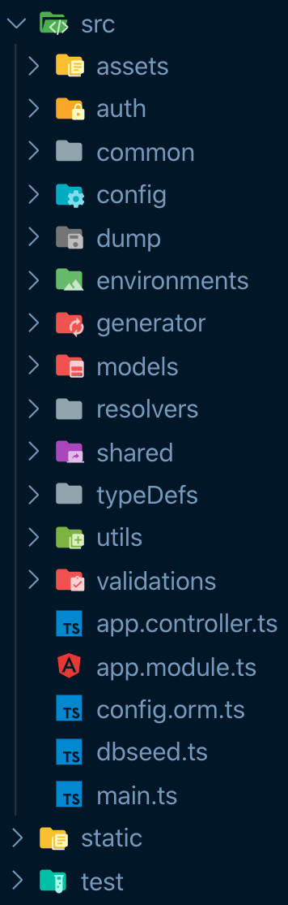

## [Version 7.5.0](https://github.com/chnirt/nestjsv7.5.0.git)

## Table of Contents

- [Structure](#structure)
- [Function](#function)
- [Usage](#usage)
- [Starting the Server](#starting-the-server)
- [Node.js Best Practices](#nodejs-best-practices)
  - [1. Project Structure Practices](#1-project-structure-practices)
  - [2. Error Handling Practices](#2-error-handling-practices)
  - [3. Code Style Practices](#3-code-style-practices)
  - [4. Testing And Overall Quality Practices](#4-testing-and-overall-quality-practices)
  - [5. Going To Production Practices](#5-going-to-production-practices)
  - [6. Security Best Practices](#6-security-best-practices)
  - [7. Performance Best Practices](#7-performance-best-practices)

## Structure



## Function

1. Dynamic import
2. Authenticate
   - Config jwt like OAuth ( access-token, refresh-token )
   - OAuth Google
   - OAuth Facebook
3. Dump database
   - Child process
4. Logger
   - NestJs
   - Wiston
5. Send mail
   - Nodemailer
6. Payment
   - Stripe
7. Task scheduler
   - Timeout
   - Interval
   - Cron
8. Translate
   - Google translate
9. Upload file
   - Cloudinary
   - Fs createWriteStream to folder static
10. Test
    - Unit
    - E2e
    - Coverage

## Usage

1. Clone repository

```
  git clone https://github.com/chnirt/nestjs-graphql-best-practice.git
```

2. Cd into directory

```
  cd nestjs-graphql-best-practice/
```

3. Create .env

```
  touch .env
```

4. Add to .env

```
  PORT=<yourport>
```

5. Install dependencies using npm

```
  npm i
```


### 7. Performance Best Practices

Our contributors are working on this section. [Would you like to join?](https://github.com/i0natan/nodebestpractices/issues/256)

[✔️] 7.1. Prefer native JS methods over user-land utils like Lodash

[❔] 7.2. Use Fastify in place of Express
